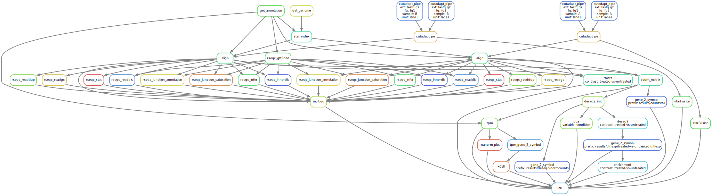

# 流程说明
此流程仅bulkrna测序数据分析。

## 流程图示例

## 流程环境
``conda activate /public/home/weiyifan/miniforge3/envs/sk8``
## 流程部署
``snakedeploy deploy-workflow https://github.com/joyling93/rna-seq-star-deseq2 . --tag v1.1.5``
## 配置信息
### config.yaml  
### samples.yaml  
### units.yaml  
## 流程运行
``snakemake -c30 --use-conda --cache``

# 样本配置  
样本和单元设置通过制表符分隔的表格文件（`.tsv`）指定。缺失值可以通过空列或写入`NA`来指定。

## 样本表

默认样本表是`config/samples.tsv`（如在`config/config.yaml`中配置）。`sample_name`是流程中的样本名固定标识，此外，在`config/config.yaml`中`diffexp:`条目下指定的所有`variables_of_interest`和`batch_effects`都必须在`config/samples.tsv`中有相应的列。
## 单元表  
默认单元表是`config/units.tsv`（如在`config/config.yaml`中配置）。

### 接头修剪（adapters）

如果你在`config/config.yaml`中将`trimming: activate:`设置为`True`，则必须在`units.tsv`文件的`adapters`列中为每个单元提供至少一个`cutadapt`接头参数。你需要填写建库时使用的接头。然后，在该单元表的`adapters`列中输入接头序列，前面加上[正确的`cutadapt`接头参数](https://cutadapt.readthedocs.io/en/stable/guide.html#adapter-types)。

### 文库制备方案的链特异性（strandedness）

为了从`STAR`输出中获得正确的`geneCounts`，你可以提供用于一个单元的文库制备方案的链特异性信息。`STAR`可以为非链特异性（`none`——这是默认值）、正向定向（`yes`）和反向定向（`reverse`）方案生成计数。将相应的值输入到`units.tsv`文件的`strandedness`列中。一般情况下不用设置。

### fastq文件来源

对于每个单元，你必须为你的`.fastq`文件定义一个来源。这可以通过`fq1`、`fq2`和`sra`列来完成，有以下几种方式：
1. 对于单端读取，一个单一的`.fastq`文件（仅`fq1`列；`fq2`和`sra`列存在但为空）。可以是系统上的任何绝对路径。
2. 对于成对末端读取，两个`.fastq`文件（`fq1`和`fq2`列；`sra`列存在但为空）。对于`fq1`列，`fq2`列也可以指向系统上的任何位置。
3. 流程可以接受 SRA 登录号（仅`sra`列；`fq1`和`fq2`列存在但为空）。工作流将自动下载相应的`.fastq`数据（目前假定为成对末端读取）。登录号通常以 SRR 或 ERR 开头，你可以使用[SRA Run/File Selector](https://trace.ncbi.nlm.nih.gov/Traces/study/)找到感兴趣研究的登录号。如果为同一单元同时指定了本地文件和 SRA 登录号，则将使用本地文件。 
  
# 参数配置
## 参考基因组
`source`: local # 数据来源，可以是local或着根据版本信息去Ensembl下载，一般选local即可，本地有小鼠和人的index直接使用，选用Ensembl下载的话，可能下载失败  
`species`: homo_sapiens  # Ensembl species name  (e.g. homo_sapiens, mus_musculus, ...)  
`release`: 100   # Ensembl release (make sure to take one where snpeff data is available, check 'snpEff databases' output)  
`build`: GRCm38 # Ensembl build (e.g. GRCh38, GRCh37, GRCm38, ...)  

## DESeq2 差异表达分析配置

为成功运行差异表达分析，你需要告知 DESeq2 样本如何分组（可在`samples.tsv`文件中定义）。这是在`config.yaml`文件中通过`diffexp:`下的条目来完成的。条目的注释应提供所有必要的信息和链接。但如果有疑问，也请查阅[DESeq2手册](https://www.bioconductor.org/packages/devel/bioc/vignettes/DESeq2/inst/doc/DESeq2.html)。  
`variables_of_interest`:   
  - condition: # 在samples.tsv中列出的变量名称，用于差异表达分组  
    - base_level: untreated # 基准水平，用于计算相对差异表达  
  - batch_effects: "" # 在samples.tsv中列出的变量名称，用于批次效应校正，一般不填  
  - contrasts: # 定义差异比较的类型  
    - treated-vs-untreated`: #代表在 condition 分组中，比较treated水平和untreated水平间的差异  
    - variable_of_interest: condition # 分组变量名称  
    - level_of_interest: treated  # 差异变量名称  
  - model: "" # DESeq2模型公式，一般不填

## Venn 图配置
contrasts: #需和`DESeq2`中的`contrasts`命名一致，至少两个

# 输出结果说明
## trimmed
接头修剪后的数据和统计
## star
star比对结果
## qc
接头修剪和比对结果质控
## counts
ensemblid/symbol的基因表达举证
## rnanorm
对应counts的 tpm normalized数据
## diffexp
deseq2差异分析结果，如果样本无重复则使用edger
## xcell
免疫浸润分析结果
## venn
venn 分析结果，只在定义至少两组比较方案时会生成
## Fusion
star-fusion融合基因预测结果
## rmats
对应每组差异分析的可变剪切预测结果
## logs
流程日志