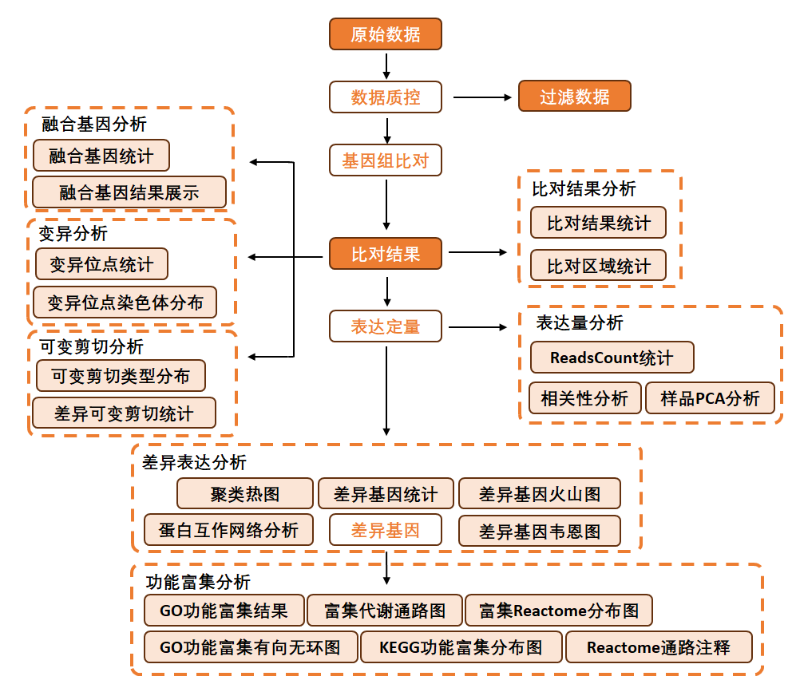
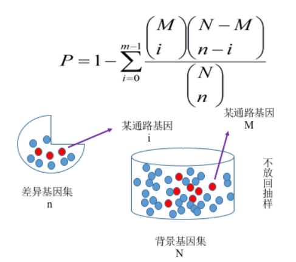
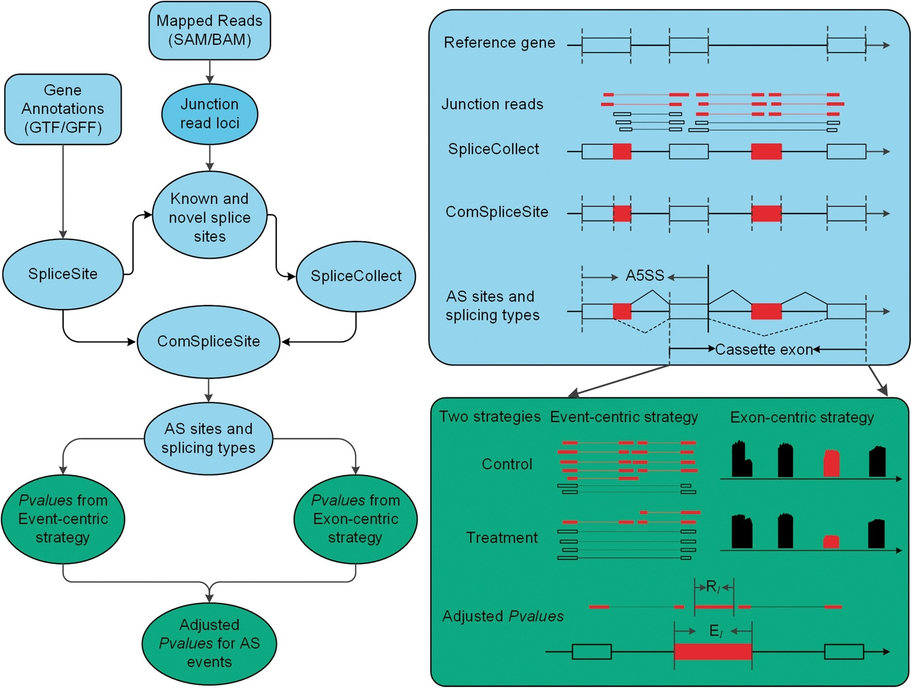

```{r setup, include=FALSE}
knitr::opts_chunk$set(echo = FALSE)
```

```{r,fig.align="left",out.height='25%',out.width='25%',echo = FALSE}

```

## 概述

转录组 ( Transcriptome ) 是指在特定环境或生理条件下的一个细胞或一个细胞群中所有 RNA 分子的集合，包括信使 RNA ( mRNA )、核糖体 RNA ( rRNA )、转运 RNA ( tRNA )及非编码 RNA ( ncRNA )。它有时被用来指所有的 RNA ，或仅指 mRNA ，指何种 RNA 取决于我们设计的特定实验，以下转录组分析仅针对 mRNA 进行研究。转录组不同于正常基因组的稳定性，它会随外界环境的变化而发生动态变化。因此，转录组可以反映不同实验条件和不同时间里基因表达的变化，但是无法获取转录衰减等 mRNA 降解现象的信息。根据实验设计获得不同的实验样本后，提取 mRNA 并通过二代测序获取 RNA 序列信息用于后续信息分析，本报告分析内容主要以转录组的差异基因分析为重点，并进行功能注释来进一步探究不同的实验设计或环境是如何影响样本的基因表达和功能的发挥

### 建库测序

转录组测序一般需要经过 RNA 样品提取，RNA 检测，测序文库构建，上机测序等一系列实验环节，最终得到用于生物信息分析的测序数据。其中每一个环节都会影响测序数据的产出和质量，从而影响后续生物信息分析结果的准确性。镁伽科技重视每一个实验环节的准确性和可靠性，以确保得到高质量的测序数据。具体建库测序流程如下：

```{r,fig.align="center",fig.cap = "建库流程"}


```

### 样品检测

高质量的RNA是整个项目成功的基础，为保证测序数据准确性，我们对 RNA 样品的检测主要包括以下几点： 

- NanoDrop™ One/OneC 检测 RNA 纯度 (OD260/280, OD260/230 比值 )
- Life Invitrogen Qubit® 3.0 荧光定量仪采用 Qubit™ RNA HS Assay Kit 精确 定量
- Agilent 4200 TapeStation 系统精确检测 RNA 完整性 ( RIN值 )。 90%，细胞浓度为 700～1200 个细胞/μl


### 文库构建与质检

#### 文库构建

样品检测合格之后，进行样品的文库构建，具体mRNA 捕获建库过程如下： 

- 真核生物大部分 mRNA 具有 polyA 的结构，采用带 Oligo ( DT ) 的磁珠对具有 polyA 结构的 mRNA 进行捕获；
- 以片段化的 mRNA 为模版，随机寡核苷酸为引物，在 M-MuLV 逆转录酶体系中合成 cDNA 第一条链；
- 用 RNaseH 降解 RNA 链，并在 DNA polymerase I 体系下，以 dNTPs 为原料合成 cDNA 第二条链；
- 纯化双链 cDNA ，并进行末端修复、加 A 尾和连接测序接头；
用 AMPure XP beads 筛选 200bp 左右的 cDNA，进行 PCR 扩增并再次使用 AMPure XP beads 纯化 PCR 产物，最终获得测序文库。

#### 文库质检
文库构建成功之后对文库进行检测，库检主要包括以下两方面： 

- Kapa qPCR 定量：精确定量文库浓度。
- Agilent 4200 TapeStation 检测：精确检测文库片段大小。

#### 上机测序

库检合格后，把不同文库按照有效浓度及目标下机数据量的需求 pooling 后进行 Illumina PE150 测序。

## 信息分析流程

目前 mRNA 转录组测序生物信息分析过程主要包括数据质控，参考基因组比对，基因表达量分析，差异基因分析，功能富集分析、差异基因的蛋白互作分析，变异检测、差异可变剪接分析、GSEA分析。分析流程如下图所示：

```{r,fig.align="center",fig.cap = "信息分析流程"}


```


### 原始数据质量控制

#### 测序数据说明

测序获得的原始数据 ( Raw Data ) 存在一定比例低质量数据，会对后续信息分析造成很大干扰。高质量的测序数据是后续信息分析结果可靠性的前提，因此需要对原始数据进行严格的数据预处理和评估。我们使用自主研发的开源软件 fastp [^1]对原始数据进行处理，对低质量序列进行过滤，过滤内容包括如下部分： 

- 去除Reads 中接头 ( Adapter )序列
- 去除 N ( N 表示模糊碱基信息 ) 碱基数达到一定比例的 Reads (默认 5bp)
- 去除所含低质量碱基 (质量值 ≤20) 超过一定比例 (默认 40%) 的 Reads
- 滑窗质量剪裁：以一定大小（默认 4bp ）为滑动窗大小，平均质量低于特定值（默认 20 ）的进行剪裁
上述的处理步骤均是对 Reads 1 和 Reads 2 进行操作。更多详细信息请查看results/qc 文件夹

#### 测序错误率分布

测序过程本身存在机器错误的可能性，测序错误率分布检查可以反映测序数据的质量，序列信息中每个碱基的测序质量值保存在 fastq 文件中。如果测序错误率用 e 表示，Illumina 的碱基质量值用 Qphred 表示，则有：Qphred=-10log10(e) 。Illumina Casava 1.8 版本碱基识别与 Phred 分值之间的简明对应关系见下表。

| Phred 分值 | 不正确的碱基识别 | 碱基正确识别率 | Q.sorce |
|:-----------|:-----------------|:---------------|:--------|
| 10         | 1/10             | 90%            | Q10     |
| 20         | 1/100            | 99%            | Q20     |
| 30         | 1/1000           | 99.90%         | Q30     |
| 40         | 1/10000          | 99.99%         | Q40     |

### 参考基因组比对分析

选取STAR  （ Spliced Transcripts Alignment to a Reference ）软件[^2] 将转录组测序 Reads 比对到参考基因组。STAR具有速度快、灵敏度和准确度高、内存消耗低等优势。Clean Reads 比对到参考基因组上获得比对特征信息并以 SAM 格式( Sequence Alignment/Map format ) 存储。SAM 序列比对格式标准由sanger制定 [^3] ，主要用于测序序列比对到基因组上信息特征的展示，BAM 文件是 SAM 文件的二进制格式，存储资源更小，常用于后续计算。基于比对结果使用 Samtools 对 BAM 文件进行排序、过滤重复 Reads 等处理，最后对序列在参考基因组上的比对结果进行统计和绘图展示。

#### 比对结果统计分析

数据下机经过质控处理后，将数据比对到参考基因组上，具体的比对结果统计见文件：
results/qc/multiqc_report.html

### 表达量分析

表达量分析是差异分析的前提，表达量分析的实质是根据各样本的比对结果统计不同基因的 Reads Count 值，即比对到该基因的 Reads 数有多少，也是后续差异基因分析的基础信息，如果基因的表达量高，则其 Reads 覆盖数也会高。

##### Reads Count 统计表
```{r }

library(purrr)
fl<-list.files("../../results/counts",pattern = 'all.symbol.xls',recursive = T,full.names = T)
map_dfr(fl,function(x){
  read.delim(x,nrows = 6)
})%>%knitr::kable(caption = '样本Reads Count统计表')
```

-   表列 ：测序样本 ID
-   表行 ：各样本中基因 Reads Count 数
-   所有基因在样本中的 Reads Count 统计请查看 results/counts/all.symbol.tsv

#### TPM 统计
TPM ( Transcripts Per Kilobase of exon model per Million mapped reads ) 是指每千个碱基的转录每百万映射读取的转录本数，是 RNA-Seq 的双端测序基因表达值的计算方式，先后对基因长度和测序深度进行校正后得到校正值，我们对 Reads Count 进行 TPM 值转换，并绘制 TPM 箱线图，通过图形可以观察不同实验条件下的基因表达水平变化。
```{r ,fig.align='center', out.height='20%',fig.cap='TPM箱线图'}

library(purrr)
fl<-list.files("../../results/rnanorm",pattern = 'tpm_box.png',recursive = T,full.names = T)
if(length(fl) >0 ){knitr::include_graphics(fl[[1]])}
```
#### 样本相关性
统计学上相关性分析 ( Correlation Analysis ) 是指对两个或多个具备相关性的变量元素进行分析，从而衡量两个变量因素的相关密切程度。对于 RNA-Seq 实验来说，生物学重复的实验样本可以通过相关性分析查看生物学实验操作的变动大小，非生物学重复关系的样本可以通过相关性分析观察不同实验条件间相似性和差异程度。通过各样本的基因定量关系，绘制样本相关性热图，观察各样本间的关系。相关系数越接近 1，说明样品间表达的模式相似度越高。在下图中颜色越深代表相关性越强。
```{r ,fig.align='center', out.height='50%',fig.cap='样本TPM表达矩阵相关性热图'}

library(purrr)
fl<-list.files("../../results/rnanorm",pattern = 'tpm_cor.png',recursive = T,full.names = T)
if(length(fl) >0 ){knitr::include_graphics(fl[[1]])}
```

#### 主成分分析
主成分分析（PCA）是将多个变量通过降维为少数几个相互独立的变量（即主成分），同时尽可能多地保留原始数据信息的一种多元统计分析方法。在转录组的分析中，PCA 将样本所包含的大量基因表达量信息降维为少数几个互相无关的主成分，以进行样本间的比较，图中样本间的距离反应了样本的相似性和离群情况，距离越近，样本越相似。
```{r ,fig.align='center', out.height='50%',fig.cap='pca 散点图'}

library(purrr)
fl<-list.files("../../results/",pattern = 'pca.condition.svg',recursive = T,full.names = T)
if(length(fl) >0 ){knitr::include_graphics(fl[[1]])}
```

### 差异表达基因分析
差异分析 ( Difference analysis ) 是在一组样本中找出产生差异的原因及其对造成差异的影响程度。根据基因的定量分析信息可进行差异基因分析，筛选不同的实验条件下的功能基因。基因差异表达分析的输入数据为基因表达水平分析中得到的Reads Count数据，分析主要分为三部分：

- 首先对 Reads Count 进行标准化（ normalization ）
- 然后根据模型进行假设检验的 P-value 以及 FoldChange 的计算；
- 最后进行多重假设检验校正，得到矫正后的 P 值( padj )

| 类型      | 软件        | 标准化方法 |p值矫正方法|
|:---------------|:-------|:-----|:-----|
| 有生物学重复 | Deseq2[^5]|软件自设 |BH[^6]|
| 无生物学重复 | EdgeR[^7] |软件自设 |BH|

#### 差异表达基因统计

基因表达具有时间和空间特异性，在两个不同条件下，表达水平存在显著差异，各比较组合间分析得到的差异表达基因统计如下表所示：

```{r }

library(purrr)
fl<-list.files("../../results/diffexp/",pattern = 'diffexp.symbol.xls',recursive = T,full.names = T)
map_dfr(fl,function(x){
  read.delim(x,nrows = 6)
})%>%knitr::kable(caption = '差异基因表达列表')
```

-   gene：差异基因的名称
-   baseMean: 所有样本均值
-   log2FoldChange：FoldChange 的 log2 值
-   pvalue：显著性检验的 P值
-   padj ：多重假设检验经过 BH 方法校正后的 P 值

#### 差异表达基因火山图
火山图 ( Volcano Plot ) 是一种展示 FoldChange 和 Pvalue 这两个重要指标的一种统计图，可以非常直观的查看在两样本间发生差异表达的基因整体分布情况。我们根据设定的阈值：padj < 0.05 ，对样本间的差异基因进行筛选获取上调和下调基因相对应的 FoldChange 和 padj 。绘制下图，图中蓝色表示为表达量下调基因，红色表示为表达量上调基因。
```{r ,fig.align='center', out.height='30%',fig.cap='差异表达基因火山图'}

library(purrr)
fl<-list.files("../../results/enrichment/",pattern = 'volcano.png',recursive = T,full.names = T)
if(length(fl) >0 ){knitr::include_graphics(fl[[1]])}
```
#### 韦恩图
韦恩图展示不同组合间差异表达基因的重叠情况，圈内所有数字之和代表该比较组合差异基因总数，重叠区域表示组合间共有的差异基因。对于两个分组(样本)间的比较情况，则展示两组(样本)之间共同表达与特异表达基因的情况，圈内所有数字之和代表该组（样本）表达基因总数，重叠区域表示组(样本)间共有的表达基因数目。
```{r ,fig.align='center', out.height='25%',fig.cap='差异表达基因韦恩图'}

library(purrr)
fl<-list.files("../../results/venn/",pattern = 'venn.png',recursive = T,full.names = T)
if(length(fl) >0 ){knitr::include_graphics(fl[[1]])}
```


### 富集分析
通过富集分析，可以找到不同条件下的差异基因与哪些生物学功能或通路显著性相关，从而揭示和理解生物学过程的基本分子机制。 我们采用 clusterProfiler[^11] 软件对差异基因集进行GO功能富集分析，KEGG通路富集分析等。富集分析基于超几何分布原理，其中差异基因集为差异显著分析所得差异基因并注释到GO或KEGG数据库的基因集，背景基因集为所有参与差异分析并注释到GO或KEGG数据库的基因集。富集分析结果是对每个差异比较组合的所有差异基因集进行富集。

```{r,fig.align="center",fig.cap = "富集分析原理图"}


```

#### GO 富集

GO(Gene Ontology)是描述基因功能的综合性数据库（<http://www.geneontology.org/>)，可分为生物过程（Biological Process）和细胞组成（Cellular Component）分子功能（Molecular Function）三个部分。GO 功能显著性富集分析给出与基因集背景相比，在差异表达基因中显著富集的 GO 功能 条目，从而给出差异表达基因与哪些生物学功能显著相关。该分析首先把所有差异表达基因向 Gene Ontology 数据库的各个 term 映射，计算每个 term 的基因数目，然后找出与整个基因集背景相比，在差异表达基因中显著富集。GO富集分析方法为clusterProfiler的enricher函数，该方法使用超几何分布检验的方法获得显著富集的GO Term。统计被显著富集的各个GOterm中的基因数,GO富集以padj小于0.05为显著富集。

##### 柱状图展示 {.tabset .tabset-fade .tabset-pills}

###### BP

```{r ,fig.align='center', out.height='50%',fig.cap='GO_BP'}

library(purrr)
fl<-list.files("../../results/enrichment/",pattern = 'bp_ora.png',recursive = T,full.names = T)
if(length(fl) >0 ){knitr::include_graphics(fl[[1]])}
```

###### MF

```{r ,fig.align='center', out.height='50%',fig.cap='GO_MF'}

library(purrr)
fl<-list.files("../../results/enrichment/",pattern = 'mf_ora.png',recursive = T,full.names = T)
if(length(fl) >0 ){knitr::include_graphics(fl[[1]])}
```

###### CC

```{r ,fig.align='center', out.height='50%',fig.cap='GO_CC'}

library(purrr)
fl<-list.files("../../results/enrichment/",pattern = 'CC_ora.png',recursive = T,full.names = T)
if(length(fl) >0 ){knitr::include_graphics(fl[[1]])}
```

#### KEGG 富集

在生物体内，不同基因相互协调行使其生物学功能，通过Pathway显著性富集能确定差异表达基因参与的最主要生化代谢途径和信号转导途径。 KEGG(Kyoto Encyclopedia of Genes and Genomes)是有关Pathway的主要公共数据库，其中整合了基因组化学和系统功能信息等众多内容。信息分析时，我们将KEGG数据库按照动物，植物，真菌等进行分类，依据研究物种的种属选择相应的类别进行分析。Pathway显著性富集分析以KEGG Pathway为单位，应用超几何检验，找出差异基因相对于所有有注释的基因显著富集的pathway，KEGG通路富集同样以padj小于0.05作为显著性富集的阈值。

```{r ,fig.align='center', out.height='200%',fig.cap='kegg富集结果',fig.show='hold'}

library(purrr)
fl<-list.files("../../results/enrichment/*/",pattern = 'kegg_ora.png',recursive = T,full.names = T)
if(length(fl) >0 ){knitr::include_graphics(stringr::str_subset(fl,'kegg')[[1]])}
```

### 差异基因蛋白互作网络
蛋白互作网络 ( Protein-Protein Interaction Networks ，PPI ) 是蛋白通过彼此之间的相互作用构成，参与基因表达调节、生物信号传递、细胞周期调控及能量物质代谢等生命过程的各个环节。我们使用 STRING ( <https://string-db.org/> ) 蛋白质互作数据库中的互作关系进行差异基因的 PPI 分析，对于差异基因的蛋白互作网路数据文件可使用 StringDB 进行可视化展示[^12]。

#### 差异基因蛋白互作网络结果展示
详细的差异基因蛋白互作网络见文件result/enrichment/ * / * /STRING_info.txt

### 差异可变剪接分析
可变剪接 ( Alternative Splicing ) 是指一个 mRNA 前体通过不同的剪接方式 ( 选择不同的剪接位点 ) 产生不同的 mRNA 剪接异构体，是真核生物基因和蛋白质数量有较大差异的重要原因。可变剪接可分为  

- skipped exon (SE)外显子跳跃
- alternative 5' splice site (A5SS)第一个外显子可变剪切
- alternative 3' splice site (A3SS)最后一个外显子可变剪切
- mutually exclusive exons (MXE)外显子选择性跳跃
- retained intron (RI)内含子滞留

等5种类型。我们使用 rmats软件进行样本间的差异可变剪接分析，可变剪接形式和软件检测流程原理如下图所示，主要根据 altered junction reads 和 altered coverage of AS-exons 计算可变剪接的差异显著性。
```{r,fig.align="center",fig.cap = "可变剪接分析原理"}


```
#### 差异可变剪接统计
每个比较组合得到的差异可变剪接统计如下表：
```{r }
library(purrr)
fl<-list.files("../../results/rmats",pattern = 'summary.txt',recursive = T,full.names = T)
map_dfr(fl,function(x){
  read.delim(x,nrows = 6)
})%>%knitr::kable(caption = '差异可变剪接统计表')
```
- EventType：可变剪接类型;
- EventTypeDescription：可变剪接类型描述;
- TotalEventsJC	：跨越剪切点的事件总数;
- TotalEventsJCEC：跨越剪切点但不跨越外显子边界的事件总数;
- SignificantEventsJC：显著的JC总数;
- SigEventsJCSample1HigherInclusion：实验组显著的JC数量;
- SigEventsJCSample2HigherInclusion：对照组显著的JC数量;
- SignificantEventsJCEC：显著的JCEC总数;
- SigEventsJCECSample1HigherInclusion：实验组显著的JCEC数量;
- SigEventsJCECSample2HigherInclusion：对照组显著的JCEC数量。

### GSEA分析
GSEA分析（Gene Set Enrichment Analysis），基因集富集分析[^19]，是目前非常常用的RNA表达分析手段。GSEA不需要指定明确的差异基因阈值，算法会根据实际数据的整体趋势，为我们提供一种合理的解决方法，即使在没有先验经验的情况下也能在表达谱整体层次上对多个基因进行分析，从而从数理统计层面把表达谱数据与生物学意义很好地衔接起来。目前分析物种只支持人、小鼠，最低条件满足3V3组合才能跑gsea分析。

#### GSEA结果展示
下图展示了kegg 数据库的 gsea富集结果
```{r }
library(purrr)
fl<-list.files("../../results/enrichment",pattern = 'kegg_gsea.csv',recursive = T,full.names = T)
map_dfr(fl,function(x){
  read.delim(x,nrows = 6,sep=',')
})%>%knitr::kable(caption = 'GSEA结果展示表')
```
- ONTOLOGY：GO类别
- ID：GO编号
- Description：GO描述
- setSize：该通路中包含表达数据集的基因数目
- enrichmentScore：富集分数
- NES：标准化后的富集分数
- pvalue ：统计学差异显著性检验的P值，一般为 0.01 或 0.05
- p.adjust ：多重假设检验经过 BH 方法校正后的 P 值
- qvalue: Q检验法矫正后的p值
- rank：当 ES 最大时，对应基因所在排序好的基因列表中所处的位置
- leading_edge：tags 表示核心基因占该通路基因集的百分比；list 表示核心基因占所有基因的百分比；signal，将前 2 项统计值结合在一起计算出的富集信号强度


### 免疫浸润分析
组织是由不同谱系和亚型的细胞类型组成的复杂环境，每种细胞都有自己独特的转录组。因此，批量转录组分析是细胞类型特异性基因表达的总和加权的细胞类型比例在给定的样本。去卷积的基因表达谱允许重建组织的细胞组成。xCell 是一个强大的计算方法，转换基因表达谱为丰富分数的免疫和基质细胞类型跨样本。

#### xCell浸润分析结果
```{r ,fig.align='center', out.height='50%',fig.cap='免疫浸润分数热图'}

library(purrr)
fl<-list.files("../../results/xCell",pattern = 'xCell.png',recursive = T,full.names = T)
if(length(fl) >0 ){knitr::include_graphics(fl[[1]])}
```

## 软件列表

| 分析内容       | 软件            | 版本 |
|:---------------|:----------------|:-----|
| 差异分析       | deseq2          |1.38  |
| 差异分析       | edgeR         |3.40.2 |
| 富集分析       | clusterProfiler |4.10.0|
| 剪接分析       | rmats           |4.3.0|
| 数据质控      |rseqc             |5.0 |
| 免疫浸润分析   |xcell             |1.3|

## 参考文献
[^1]: Shifu, C. , Yanqing, Z. , Yaru, C. , & Jia, G. (2018). Fastp: an ultra-fast all-in-one fastq preprocessor. Bioinformatics, 34(17), i884-i890. 

[^2]: Dobin, A., et al. (2013). STAR: ultrafast universal RNA-seq aligner. Bioinformatics (Oxford, England), 29(1), 15–21. https://doi.org/10.1093/bioinformatics/bts635  

[^3]: Li, H. E. A. (2009). The sequence alignment / map ( sam ) format. Bioinformatics, 25(1 Pt 2), 1653-4. 

[^4]: Liao Y, Smyth GK, Shi W. featureCounts: an efficient general purpose program for assigning sequence reads to genomic features. Bioinformatics. (2014);30(7):923-930. doi:10.1093/bioinformatics/btt656 

[^5]: Love, M. I. , Huber, W., & Anders, S. (2014). Moderated estimation of fold change and dispersion for RNA-seq data with DESeq2. Genome Biol, 15(12), 550. 

[^6]: Benjamini, Y. , Hochberg, Y. (1995). Controlling the False Discovery Rate - a Practical and Powerful Approach to Multiple Testing. J Roy Stat Soc B, 57(1), 289-300. 

[^7]: Robinson, MD. , McCarthy, DJ. , Smyth, GK. (2010). edgeR: a bioconductor package for differential expression analysis of digital gene expression data. Bioinformatics, 26, 139–140. 

[^8]: Ptashne, M. , & Gann, A. (1997). Transcriptional activation by recruitment. Nature (London), 386(6625), 569-577. 

[^9]: Matys, V. , Kelmargoulis, O. V. , Fricke, E. , Liebich, I. , Land, S. , & Barredirrie, A. , et al. (2006). Transfac and its module transcompel: transcriptional gene regulation in eukaryotes. Nucleic Acids Research, 34(Database issue), D108-D110. 

[^10]: Hu, H. , Miao, Y. R. , Jia, L. H. , et al. (2019). AnimalTFDB 3.0: a comprehensive resource for annotation and prediction of animal transcription factors. Nucleic Acids Res, 47(D1), D33-D38. 

[^11]: Yu, G. , Wang, L. G. , Han, Y. , & He, Q. Y. (2012). Clusterprofiler: an r package for comparing biological themes among gene clusters. Omics-a Journal of Integrative Biology, 16(5), 284-287. 

[^12]: Szklarczyk D, Gable AL, Nastou KC, Lyon D, Kirsch R, Pyysalo S, Doncheva NT, Legeay M, Fang T, Bork P, Jensen LJ, von Mering C (2021). “The STRING database in 2021: customizable protein-protein networks, and functional characterization of user-uploaded gene/measurement sets.” Nucleic Acids Research (Database issue), 49.  

[13]: Wu W, Zong J, Wei N, Cheng J, Zhou X, Cheng Y, Chen D, Guo Q, Zhang B, Feng Y. CASH: a constructing comprehensive splice site method for detecting alternative splicing events. Briefings in Bioinformatics. Apr 2017. doi: 10.1093/bib/bbx034. 

[^14]: HAAS, B. , DOBIN, A. , STRANSKY, N. , LI, B. , YANG, X. , TICKLE, T. , BANKAPUR, A. , GANOTE, C. , DOAK, T. , POCHET, N. , SUN, J. , WU, C. , GINGERAS, T. & REGEV, A. (2017). STAR-Fusion: Fast and Accurate Fusion Transcript Detection from RNA-Seq. bioRxiv. 

[^15]: Dobin, A. , Davis, C. A. , Schlesinger, F. , Drenkow, J. , Zaleski, C. , & Jha, S. , et al. (2013). Star: ultrafast universal rna-seq aligner. Bioinformatics, 29(1), 15-21. 

[^16]: Mckenna, A. , Hanna, M. , Banks, E. , Sivachenko, A. , Cibulskis, K. , & Kernytsky, A. , et al. (2010). The genome analysis toolkit : a mapreduce framework for analyzing next-generation dna sequencing data. GENOME RESEARCH, 20(9), 1297-1303.  

[^17]: Sahraeian, S. M. E. , Mohiyuddin, M. , Sebra, R. , Tilgner, H. , Afshar, P. T. , & Au, K. F. , et al. (2017). Gaining comprehensive biological insight into the transcriptome by performing a broad-spectrum rna-seq analysis. Nature Communications, 8(1), 59. 

[^18]: Wang, K. , Li, M. , & Hakonarson, H. (2010). Annovar: functional annotation of genetic variants from high-throughput sequencing data. Nucleic Acids Research, 38(16), e164-e164. 

[^19]: Subramanian A, Tamayo P, Mootha VK, Mukherjee S, Ebert BL, et al. Gene set enrichment analysis: a knowledge-based approach for interpreting genome-wide expression profiles. Proc Natl Acad Sci U S A. 2005;102:15545–15550. 

[^20]: Newman, A. M., Liu, C. L., Green, M. R., Gentles, A. J., Feng, W., Xu, Y., … Alizadeh, A. A. (2015). Robust enumeration of cell subsets from tissue expression profiles. Nature Methods, 12(5), 453–457. 

[^21]: Chen, Shifu. "Ultrafast one‐pass FASTQ data preprocessing, quality control, and deduplication using fastp." iMeta (2023): e107.